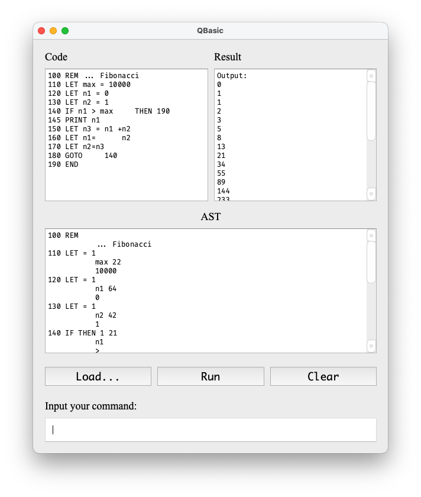

# Software Basic Practice - Basic Interpreter with Qt

Here is my personal implementation of the Basic interpreter, served as the submission of the project of SJTU SE course - software basic practice (SE2308, or SE1301 originally).



## Instruction

[Here](doc/QBasic-doc.pdf) is the original project document.

QBasic is a demanding, annoying and ugly-designed project. Some requirements in the doc are either overwhelming or useless, which may waste a lot of time.

To dig some entertainment, though, I implement the interpreter with a strict **client-server** model. Specifically, you can see two subfolders in the `src` folder: `backend` and `frontend`. The backend of the interpreter is implemented with [ANTLR4](https://www.antlr.org/), a elaborated-designed parser generator. The frontend depends on Qt6.

You can even build the backend separately as a library that is independent with Qt. That's the key feature of my implementation.

Another feature is that the backend is well-tested. You can check the test cases in `test` folder.

## Build and Test

Make sure you've installed `cmake` and the Qt library. The `CMakefile.txt` uses `find_package` to find Qt. You can also use the environment variable `CMAKE_PREFIX_PATH` to tell `cmake` where to find the package.

```sh
# For configuration, ANTLR4 project will be downloaded,
# so it may take some time.
# Try to open your proxy to accelerate.
cmake -S . -B build
cmake --build build --target all
```

You can run the test cases:

```sh
cd build/test # you need to `cd` to this directory
./test_editor

[doctest] doctest version is "2.4.11"
[doctest] run with "--help" for options
===============================================================================
[doctest] test cases:  2 |  2 passed | 0 failed | 0 skipped
[doctest] assertions: 14 | 14 passed | 0 failed |
[doctest] Status: SUCCESS!

./test_interpreter
[doctest] doctest version is "2.4.11"
[doctest] run with "--help" for options
===============================================================================
[doctest] test cases:  2 |  2 passed | 0 failed | 0 skipped
[doctest] assertions: 14 | 14 passed | 0 failed |
[doctest] Status: SUCCESS!
```

The APP is located in `build/app`.

## License

MIT.